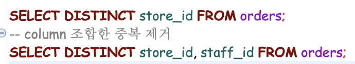
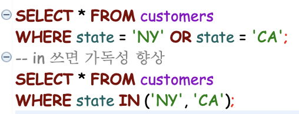
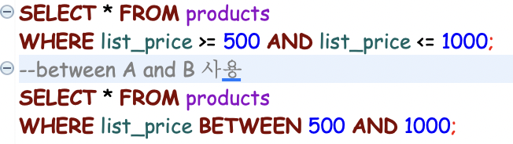
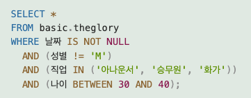
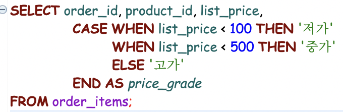
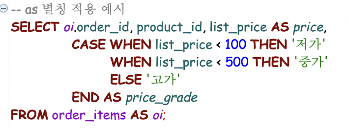
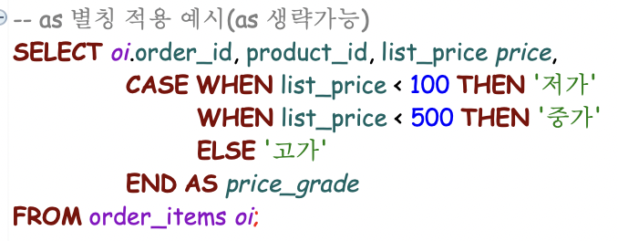
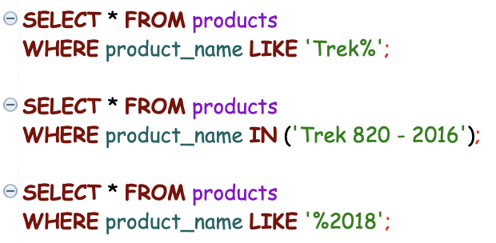
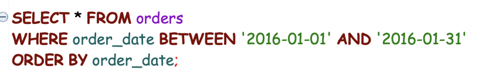

## 데이터 조회
---
#### DML-SELECT (조회)
- `SELECT column FROM table WHERE condition;`

(전체 조회(*)가 아닌 컬럼명 나열시 원하는 순서대로 컬럼 나열 가능)

- `SELECT [ALL | DISTNICT] 열이름 FROM 테이블명;`
  - ALL: 기본값(중복을 포함한 전체)
  - DISTINCT: 레코드에서 중복을 제거한 고유한 값만 조회
  - 

---
[실행 순서]
1. FROM 테이블명
2. WHERE 조건식
3. SELECT 컬럼명

---

 - WHERE 조건식: 조회의 범위를 좁힌다.
    - 비교 연산자: `(>, <, >=, <=, =)`
    - 논리 연산자: `(AND, OR, NOT)`
    - `IN`: 포함시 True, `NOT IN`: 미포함시 True
    - 
    - `BETWEEN`: A AND B = 'A에서 B 사이'
    - 
    - `IS NULL`: 값이 빈 상태인지 체크
    - `IS NOT NULL`: 값이 있는 상태인지 체크
    - NULL은 값이 없는 상태이므로 비교, 산술등의 연산이 불가함
    - 
    - `CASE WHEN`: 조건에 따라 새로운 열에 새로운 값을 추가하는 경우 (필드를 명시하는 위치, FROM절 앞쪽에 적용)
      - 
      - ELSE 결과: 모든 조건이 거짓일 때 값

---
- AS(Alias): 별칭 / 생략가능
  - 컬럼명 뒤에 적용 -> 다른 컬럼명으로 변경
  - 테이블명 뒤에 적용 -> 다른 테이블명으로 변경
  - 
  - 

---
- `LIKE`
  - `LIKE keyword`: 키워드에 정확히 매칭
  - `LIKE keyword%`: 키워드로 시작하는 패턴 찾기
  - `LIKE %keyword`: 마지막에 키워드로 끝나는 패턴 찾기
  - `LIKE %keyword%`: 키워드가 포함된 패턴
  - 
---
- `ORDER BY` 정렬
    - 
    - `ORDER BY 컬럼명 [ASC | DESC] [, column...]`
    - ASC 오름차순, 기본값(생략)
    - DESC 내림차순
    - 2차 정렬은 1차 정렬 이후 

---