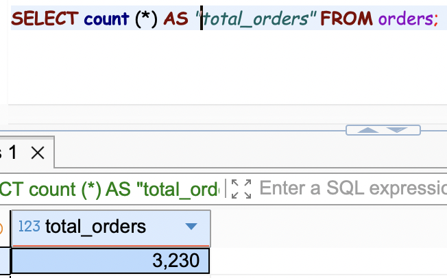
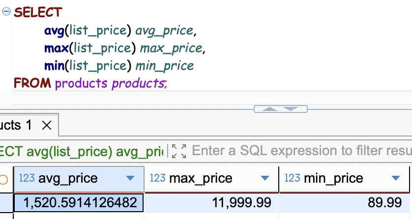
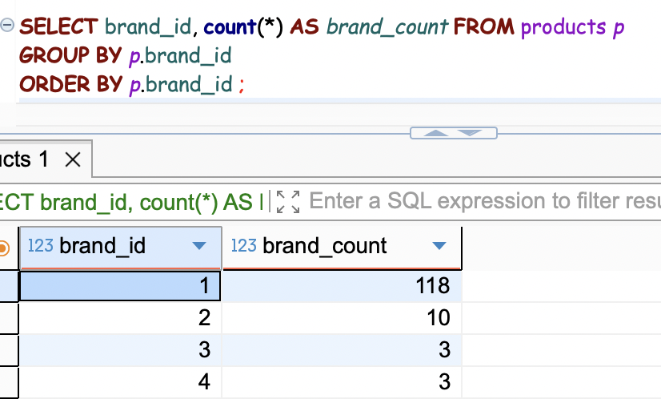
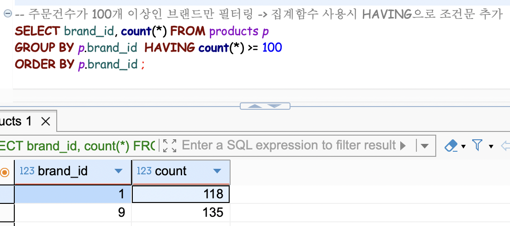
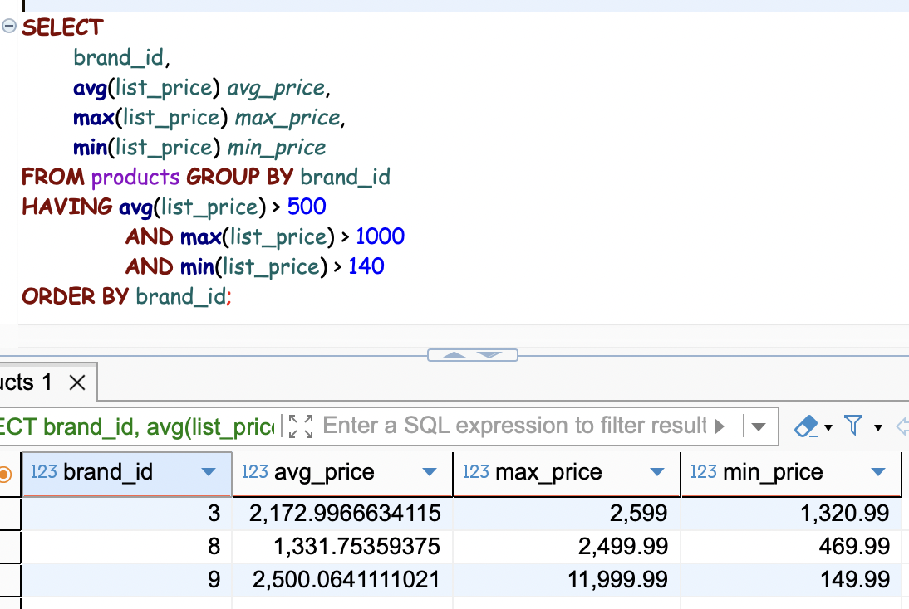

## 데이터 집계와 분석
---
통계(집계)
1. 집계 함수
    - `COUNT(column1, column2, ...)`: 레코드 개수 조회
      - NOT NULL column만 개수 조회
      - `COUNT(*)`: NULL 상관 없이 모든 행 개수 조회
      - 
    - `SUM(column)`
    - `AVG(column)`
    - `MIN(column)`
    - `MAX(column)`
    - 

2. `GROUP BY`
   - `SELECT ... FROM ... WEHRE ... GROUP BY column(s)`
   - 특정 column 기준으로 grouping (column의 같은 값 기준)
   - 집계 함수와 함께 쓰이는 경우가 많음
   - 레코드 갯수는 그룹핑된 결과 갯수만큼 조회
   - 조회 column은 반드시 group by에 명시된 column만 사용 가능
   - WHERE에서 집계함수 포함 조건 사용 불가
   - 

3. `GROUP BY HAVING`
   - 집계함수 조건 사용 가능
   - 
   - 