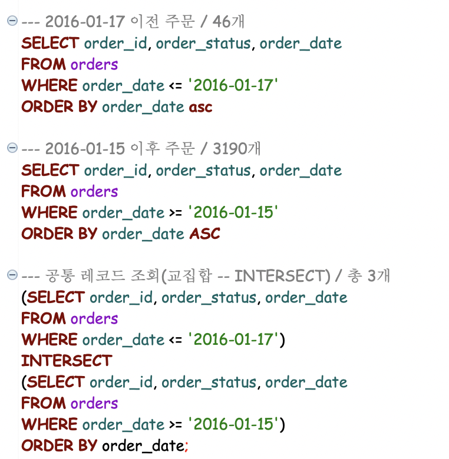
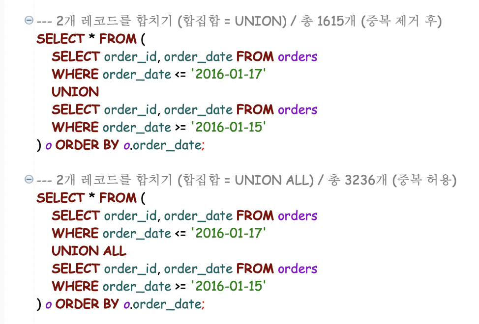
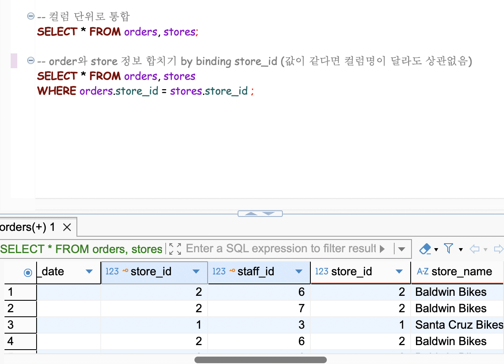
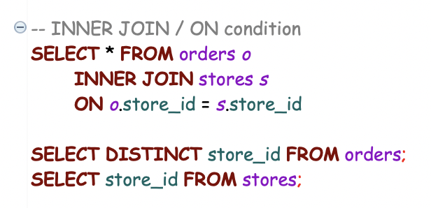

## RDBMS: 관계형 데이터베이스
--- 
[집합: 중복 없음]
1. 합집합: UNION
   - UNION ALL: 중복 허용
2. 교집합: INTERSECION 공통적인 것
3. 차집합: EXCEPT

---

---

---

---

`JOIN`: 두 테이블에서 공통적인 값을 기준으로 테이블을 하나처럼 조회할 수 있도록 결합해줌
- `INNER JOIN`: 동등조인(교집합), 내부조인, 자주 사용, 기본값 = INNER 키워드는 생략 가능
- 

--- 

- `LEFT JOIN`:
- `RIGHT JOIN`:
- `FULL OUTER JOIN`: