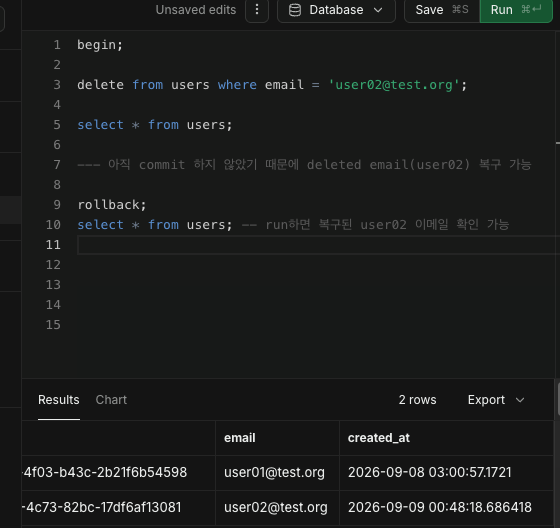

## 트랜잭션 4가지 원칙
- A: Atomicity 원자성 = All or Nothing
- C: Consistency 일관성 = 규칙(제약조건)을 위반하지 않음
- I: Isolation 격리성 = 동시 트랜잭션이 서로 간섭하지 않음(동시성 문제) ex) 은행, 예약
- D: Durability 지속성 = COMMIT -> DB에 영구 반영
---
[transaction]
```
BEGIN; -> 트랜잭션 시작
...
...
...
...
COMMIT; -> 트랜잭션 종료 (DB 영구 반영)

ROLLBACK; -> 트랜잭션 복구 (COMMIT 전에만 가능)
```


---
