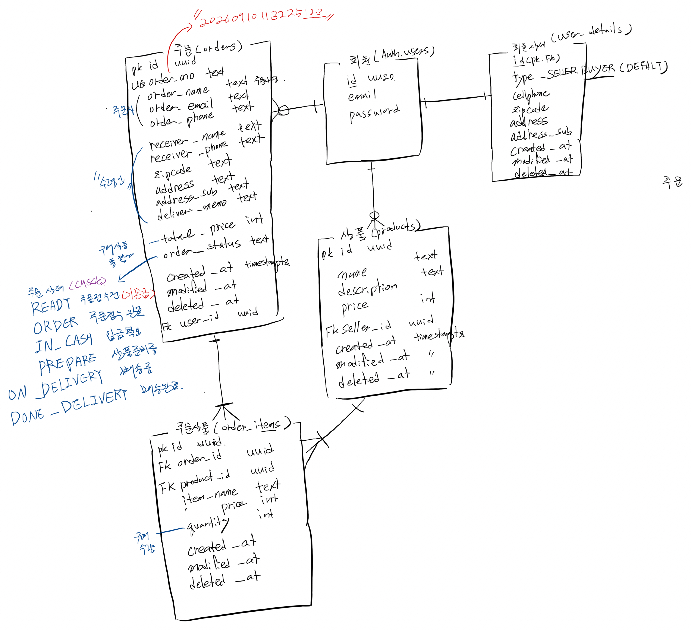

[SUPABASE 쇼핑몰 CRUD 실습]
- 회원테이블 (id=uuid, email, password)

- 회원정보상세 테이블(회원테이블과 1:1 관계) - id(pk, fk), member_type-enun/check(seller/buyer) default, address, address_sub, phone, zipcode, joined_at, modified_at, deleted_at

- 상품 테이블 - id (pk, uuid), name(txt), description(txt), price(int), seller_id(uuid, fk), created_at, modified_at, deleted_at / 회원과 1:n

- 주문 테이블- id (pk/fk), user_id(fk, uuid), order_no(txt, unique), orderer_name/email/phone(txt,주문자정보), receiver_name/_phone/zipcode, address, address_sub, delivery_memo(txt, 수령인정보), total_price(int, 구매제품 총 합계), order_status(check 제약조건 - READY주문접수전(기본값), ORDER주문접수완료, IN_CASH입금확인, PREPARE상품준비중,ON DELIVERY 배송중, DELIVERED 배송완료), created_at, modified_at, deleted_at

- 주문상품 테이블(order_items, 주문테이블과 1:n 관계) - id(pk, uuid), order_id(fk, uuid), product_id(uuid, fk), item_name(txt), item_price(int), quantity(int, 구매수량), created_at, modified_at, deleted_at

1. supabase project share
2. define tables
3. connect api and create CRUD
4. see how it works.