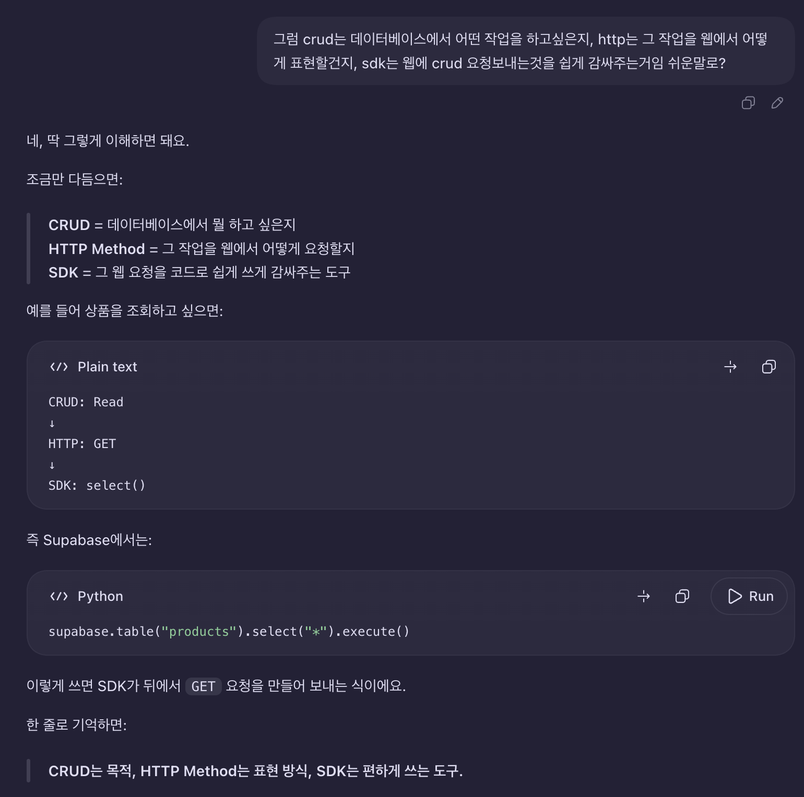
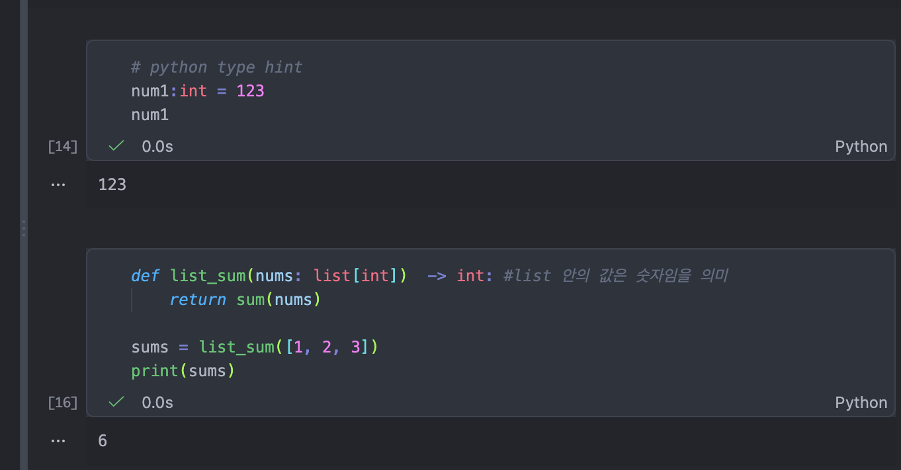
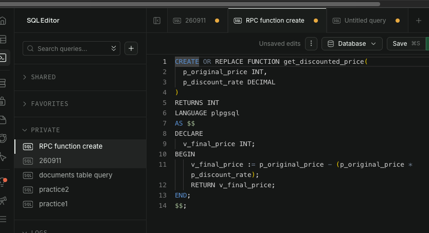
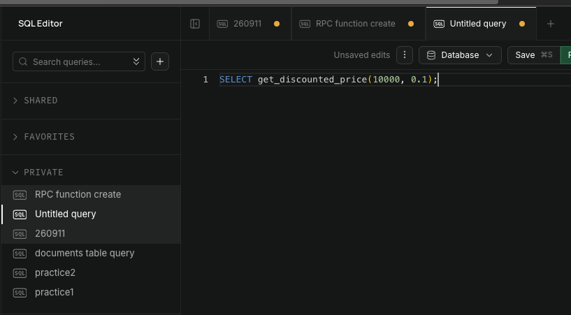
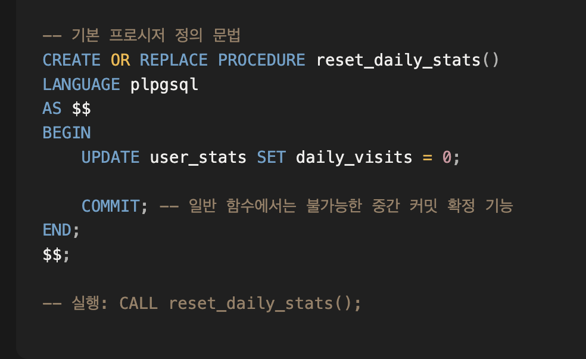

260910
API(Application Programming Interface)
- app 개발 명세서, app 개발 설계 명세
- API는 프로그램과 프로그램 사이에서 요청과 응답을 전달해주는 창구
예를 들어 Python에서 상품 데이터를 요청하면 Supabase REST API가 그 요청을 PostgreSQL에 전달하고, 데이터베이스에서 찾은 결과를 다시 Python에 돌려줍니다.
그리고 Supabase SDK를 사용하면 복잡한 HTTP 요청을 직접 작성하지 않고 Python 코드로 쉽게 API를 사용할 수 있습니다.

1. REST API (Representational State Transfer API): 표현적 상태 전이 (어떠한 상태를 전달?)
   - 행위와 자원
     - **행위**: CRUD (create, read, update, delete). HTTP method(POST, GET, PUT, PATCH, DELETE)
     - **자원**: URI (Uniform Resource Identity) 고유자원식별자
     - *(URL - Uniform Resource Locater)

- Supabase는 CRUD 작업을 HTTP Method 형태로 처리하고, 개발자는 이를 SDK를 통해 더 쉽게 수행할 수 있습니다.

- 자원: each table
- 행위: supabase rest api는 sdk, 이 sdk는 HTTP 요청 작성을 대신 간단하게 감싸주는 것
- 

- “Supabase에서는 Python 애플리케이션이 데이터베이스에 직접 접근하는 것이 아니라 REST API를 통해 통신합니다. 개발자는 SDK를 사용하기 때문에 GET이나 POST 같은 HTTP 요청을 직접 작성하지 않고 select, insert, update, delete 같은 메서드로 사용할 수 있습니다. SDK는 이를 HTTP 요청으로 변환하고, REST API가 PostgreSQL 데이터베이스에 전달합니다. 그리고 Supabase는 데이터베이스 스키마를 기반으로 REST API를 자동 생성해준다는 장점이 있습니다.”

---
python type hint: “이 변수나 함수에는 이런 종류의 값이 들어올 거예요”라고 미리 표시하는 것"
- 사용 목적:
  - 코드 읽기 쉬워짐: 다른 사람이 봐도 어떤 값이 들어오는지 바로 알 수 있음.
  - 실수 줄이기: IDE가 "문자열 넣으면 이상한데?" 같은 경고를 줄 수 있음.
  - 자동완성 도움: VS Code 같은 IDE가 변수의 타입을 알아서 관련 메서드를 더 잘 추천함.
  - 큰 프로젝트에서 관리하기 편함: 함수가 많아질수록 어떤 데이터가 오가는지 추적하기 쉬움.
- 변수: 타입 (힌트 제공)
- ex) num:int = 100
- ex) title:str = "ABC"
- list, tuple, dict 등도 명시 가능
- 클래스->타입
- 함수도 반환값 타입 명시 가능
- ex) def 함수(...) -> 타입(반환타입):.. | 반환값 없는 경우 void
- type 힌트와 잘못된 값이 들어와도 강제하지 않음.
-  
-  


---
[Stored Program] 특강
1. Function
- 매개변수와 반환값
- `SELECT` 구문 내에서 사용 가능함 ex) `AVG(...), SUM(...)`
- TCL은 사용 불가
- `RETURN` 사용


- 확인

- 독립적인 실행

2. Procedure
- 독립 프로그램
- `CALL 프로시저명(....);`
- 트랜잭션 제어 가능(BEGIN, COMMIT, ROLLBACK 정의 가능)

-  반복문(LOOP) 기반의 배치 프로시저
```
CREATE OR REPLACE PROCEDURE batch_archive_logs(p_batch_size INT)
LANGUAGE plpgsql
AS $$
DECLARE
    v_rows_affected INT := 0;
    v_total_processed INT := 0;
    v_iteration INT := 0;
BEGIN
    LOOP
        v_iteration := v_iteration + 1;

        -- 서브쿼리를 통해 지정한 배치 크기만큼만 잠금(FOR UPDATE) 및 업데이트
        WITH target_batch AS (
            SELECT id FROM service_logs 
            WHERE is_archived = FALSE 
            ORDER BY id LIMIT p_batch_size
            FOR UPDATE
        )
        UPDATE service_logs 
        SET is_archived = TRUE 
        WHERE id IN (SELECT id FROM target_batch);

        -- 직전 UPDATE로 영향을 받은 행 개수 추출
        GET DIAGNOSTICS v_rows_affected = ROW_COUNT;
        
        -- 더 이상 처리할 데이터가 없으면 루프 즉시 탈출
        EXIT WHEN v_rows_affected = 0;

        v_total_processed := v_total_processed + v_rows_affected;
        RAISE NOTICE '[배치 %회차] %건 처리 완료 (누적: %건)', 
            v_iteration, v_rows_affected, v_total_processed;

        --  매 배치 회차마다 즉시 확정하여 락을 해제함
        COMMIT;
    END LOOP;

    RAISE NOTICE '[최종 완료] 총 %건의 로그 보관 처리가 완료되었습니다.', v_total_processed;
END;
$$;
```
```
-- 백엔드 스케줄러(Cron) 등에서 프로시저 호출 (5만 건을 5,000건 단위로 10번에 나누어 커밋)
CALL batch_archive_logs(5000);
```
3. Trigger