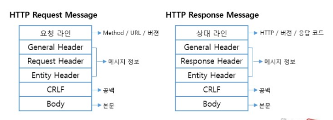
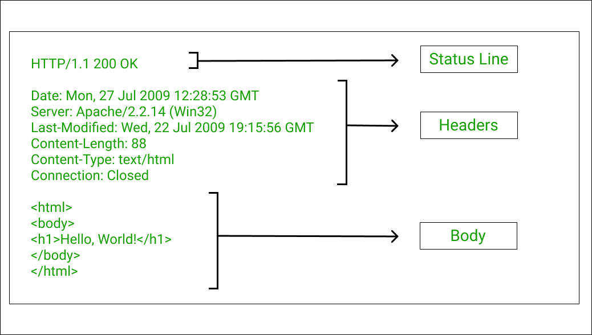

hyperlink
- 페이지 이동 역할
- `<a>` hyperlink tag
  - 속성 attribute(태그의 추가 정보/태그 기능 수행 위한 정보):
  - `href`: 이동할 경로 주소
    - 절대경로
      - 전체 url 
      - 전체 파일 경로: 경로 변경시 출력 안됨
    - 상대경로
      - `./`: 현재 파일이 있는 폴더 경로
      - `../`: 현재 파일의 바로 위 상위 폴더 경로
  - `target`: 출력할 창의 위치
    - _self: (default) 현재 창
    - _blank: 새로운 창
    - _parent: 부모 창(바로 위)
      - `<iframe>`: 자식 창
        - src: 함께 출력할 경로 (url)
        - name: 창의 이름
    - _top: 가장 상위에 있는 창
    - 창의 이름


2. Form tag
   
 `<input></input>` : 사용자로부터 입력 받는 태그
  - type 입력 유형
    - `text`: (기본값)
    - `password`: 비밀번호 입력 필드
    - `radio`: 여러개 중 하나만 선택 가능한 라디오 버튼
      - **name으로 그룹 정해줘야 여러개 중 하나 선택 가능**
    - `checkbox`: 중복 선택 가능
    - name 
      - 1. 전송할 값의 이름 (**name이 없는 값은 전송되지 않음**)
      - 2. `radio`, `checkbox`의 그룹 명칭
  - `action`: 제출 처리 URL(서버 url)
  - `method`: 요청 방식
    - GET(default): 자원**조회**/검색, 전송할 데이터는 url에 포함. QueryString=`_?이름=값&이름=값...`
      - - ex) `/products?category=book&page=1`
    - POST: 서버에 **변경**을 가하는 **요청**, 요청전문의 **body**에 실려 전송. ex) 회원가입, 글작성, 상품등록


- header: contains the info of the data to be submitted (to a server?)
- body: contains data format

`<button>`
  - type=
    - "SUBMIT": 양식 제출
    - "RESET": 양식 입력 취소
    - "BUTTON": 일반 버튼
    
태그와 입력 요소를 연결 
  - by `<label>`
  - by `for`(label) `id`(입력요소, 유일무이한 값) 속성 연결 (01-5.html 참고)


`required` 필수 입력 항목
- min
- max
- stop   

`placeholder` 안내 문구

`readonly` 읽기전용(데이터전송 o)

`disabled` 기능 무력화(데이터전송 x)

`textarea` 여러줄 텍스트 입력

`select` 여러개 중 한개. `option`과 함께 사용
  - `option` 선택항목
  - `multiple` 여러개 선택
  - `size`: 한번에 보일 개수 지정

input type=""
`email`
`number`
`color`
`range`
`date`
`time`
`datetime`

--- 
## `href` vs `src`

### `href`
- `href` = **Hypertext Reference**
- 다른 페이지나 파일을 **연결하거나 참조**할 때 사용
- 주로 `<a>`, `<link>` 태그에서 사용

```html
<a href="https://google.com">Google</a>
```

- 클릭하면 해당 주소로 이동

```html
<link rel="stylesheet" href="style.css">
```

- 외부 CSS 파일을 연결


### `src`
- `src` = **Source**
- 외부 파일을 현재 HTML 문서 안으로 **불러올 때** 사용
- 주로 ``, `<script>` 태그에서 사용

```html

```

- `cat.jpg` 이미지를 현재 페이지에 불러옴

```html
<script src="script.js"></script>
```

- 외부 JavaScript 파일을 현재 페이지에 불러옴


### `href` vs `src` 차이

| 속성 | 의미 | 역할 | 대표 태그 |
|---|---|---|---|
| `href` | Hypertext Reference | 다른 위치나 파일을 **연결 / 참조** | `<a>`, `<link>` |
| `src` | Source | 파일을 현재 페이지로 **불러옴** | ``, `<script>` |

### 쉽게 기억하기

- `href` → **어디로 연결할까?**
- `src` → **무엇을 가져올까?**

---
