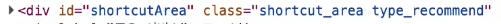

[CSS (Cascading Style Sheets)]
- Cascading the style 
- 웹 문서에 스타일링 담당

1. 스타일 적용 기본 구조
```css
/* style.css */
selector1 {
    attribute: value;
}
selector2 {
    attribute: value;
}
```
- selector
  - basic selectors
    - `*`
    - `tag`
    - `class`
    - `id`
  - combinators
    - 자식 선택자
    - 하위 선택자(all descendants) 
- attribute
  - color
  - background
  - width
  - height

- value
---
2. 적용 방법
- 인라인 스타일: 태그의 스타일 속성에 직접 적용
- 내부 스타일 시트:
  - `<style>...</style>` 태그 안에 스타일 정의
- 외부 스타일 시트:
  - CSS 파일 생성하고 연동 by `<link>`
  - 실무/프로젝트에서 주로 사용
---
3. 주석
`/*...*/`
  - 설명
  - css engine 해석 배제
---
4. Selector
- * (전체선택자)
- tag selector(태그 이름)
- class selector(클래스명)
  - ` .classname {}`
  - 하나의 element에 여러개의 class 붙이기 가능, 띄어쓰기
  - 여러개 요소 선택, 복수개 선택 가능
  - 
- id selector(`# id`)
  - id = unique
---
5. 스타일 적용 우선순위 (범위 넓을수록 하위, 범위 좁을수록 상위)
 `tag < class < id < style attribute`
  
- `*, tag, class` 가장 많이 사용 (가급적 tag, class 사용)
- tag: 공통 스타일
- class: 세부 스타일

참고) 우선순위 강제 적용 by `!important` but 절대로 남용 X

---
6. Combinators 복합관계선택자 - [03/04.html 참고]
- 하위선택자`(조상 - 자손)`
  - 조상 ... 자손
- 자식선택자`(부모 > 자식)`
- 형제 선택자
  - 일반 형제 선택자`(형 ~ 동생)`: 형 제외, 동생들 모두
  - 인접 형제 선택자`(형 + 동생)`: 형 제외, 동생 하나만
- 그룹 선택자 (,)
- 속성 선택자
  - [속성명]: 지정된 속성이 있으면 선택, 다른 선택자와 조합을 통한 선택
  - [속성명="값"]: 속성의 값이 일치하는 요소 선택
  - [속성명^="값"]: 속성이 값으로 시작하는 요소를 선택
  - [속성명$="값"]: 속성이 값으로 끝나는 요소를 선택
  - [속성명*="값"]: 속성 값이 포함된 요소
- 가상클래스 선택자 `선택자: 상태, 조건, 위치`: **타입이 서로 다른 자식요소 선택됨**
    - `:first-child` 첫번째 자식 요소 =`first-of-type`
    - `:last-child` 마지막 자식 요소 =`last-of-type`
    - `:nth-child` = `nth-of-type`
      - 함수처럼 정의: `:nth-child(num)`, num starts from 1
      - 수식으로 계산: `:nth-child(equation)`, child chosen based on equation 
        - (2n+1) : 홀수
        - (2n): 짝수
    - `first-of-type`, `last-of-type`, `nth-of-type`, `only-of-type`(자식요소 하나만 있는 경우) : **같은 타입의 자식들만 선택됨**
  - 조건선택자
    - `:not(선택자)`: 선택자가 아닌요소 선택
    - `:is(선택자1, 선택자2, ...)`: 상위요소 그룹지어서 하위요소를 선택할 때 사용
  - 상태선택자
    - `:hover`: 마우스가 요소에 올라간 상태
    - `:focus`: 특정요소가 선택, 커서가 있는 상태 <-> `:blur`
    - `:checked`: 체크된 상태
    - `:read-only`: 읽기 전용 상태
    - `:disabled`: 비활성 상태  <-> `:enabled`
  

  - 요소 추가 선택자 `selector::__` 
    - 반드시 추가할 내용이 있어야 노출됨 --> `content`  필수
    - `::before`: 자식의 첫번째 요소로 추가
    - `::after`: 자식의 마지막 요소로 추가
    - `::placeholder`: 가이드라인 텍스트 style 추가
    - `::selection`: 마우스 드래그 선택된 영역

---
CSS 속성
1. 텍스트 및 폰트 속성
  - color: 폰트 색상  
    - 색상명: red, blue, ...
    - rgb: (red, green, blue) each: 0~255
    - 16진법 표기 (HEXCODE) : ex) rgb(255=>FF, 0, 0)
    - rgba

2. font-size
   - 절대크기
     - px
     - pt
   - 상대크기
     - em
     - rem: 
  
3. box-sizing: 너비와 높이의 기준
  - content-box(기본값): 내용영역(content)기준
  - border-box: 경계선(border)이 기준

외부 여백(margin)
- block 속성태그: 제한x
- inline 속성태그: 위아래여백 x, 좌우여백 o

`margin: 상 우 하 좌;`
`margin: 상 좌우 하;`
`margin: 상하 좌우;`
`margin: 값;` -> 모든방향  

---
display
1. block => block이 아닌 속성
2. inline => inline 
3. inline-block 
4. none -> 감추기 (공간도 사라짐)
   - 참고: visibility: 기본값 visible, hidden 감추기 (단순히 눈에만 사라지고 공간은 여전히 차지)
