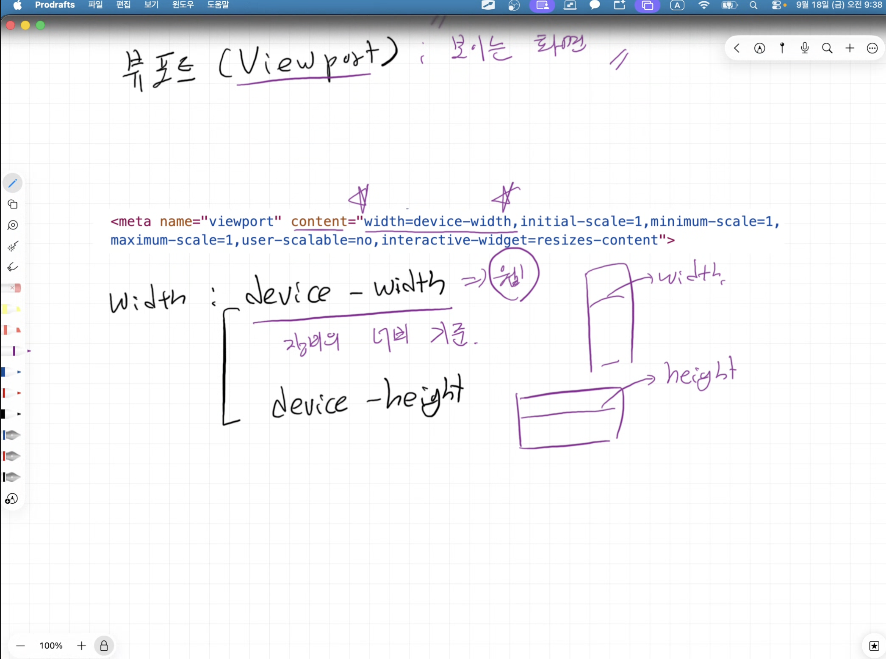
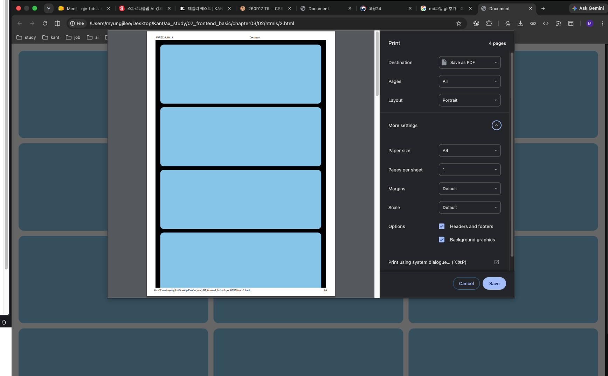

Viewport: 보이는 화면


- width
  - device-width
  - device-height
- scale: 확대/축소시 사용
  - user-scalable
    - yes: 유저가 확대/축소 가능
    - no: 불가능
  - minimun-scale: 축소 비율
  - maximum-scale: 확대 비율
  - initial-scale: 처음 화면 비율 (1이 일반적)
- interactive-widget


---
미디어쿼리 (@media ....)
```css
@media 미디어타입(장비종류) and (미디어특성 - breakpoint 설정을 주로 지정) {
    /* css 정의(@media에 붙인 조건이 참일때만 실행할 css code)*/
}

ex)

@media screen and (min-width: 768px) {
  body { background-color: lightgreen; }
}
/* 출력 대상 기기가 스크린(모니터/스마트폰)이고, 화면 가로폭이 최소 768px 이상일 때 배경색을 연초록색으로 바꿉니다. */
```


- 미디어타입
  - all: 모든 미디어 장치에 스타일 적용(생략시 기본값)
  - screen: 스크린이 있는 모든 기기
  - print: 프린트에만 해당하는 css <2.html참고>
  -  
  - speech: 스크린리더

- 미디어특성
  - width/height
  - min-width: ~크기 이상
  - max-width: ~크기 이하
  - orientation
    - portrait: 세로 방향
    - landscape: 가로 방향

기기별 권장 사양 breakpoint -> 기준에 따라 css 적용이 달라짐. 
- 모바일 
  - max-width: 767px
- 태블릿 
  - min-width: 768px 
  - max-width: 1023px
- 데스크탑 
  - min-width: 1024px

